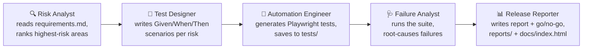

# qa-agent-crew

A multi-agent QA automation showcase: five [CrewAI](https://github.com/crewAIInc/crewAI)
agents that read a requirements doc, design test scenarios, write and run
real [Playwright](https://playwright.dev/python/) tests against a public
demo site, analyze any failures, and publish a release-quality report —
end to end, live, in GitHub Actions.

**Hard constraint: free tier only.** No paid APIs, no credit card,
anywhere. Every LLM call goes through a small fallback chain (Gemini →
Groq → local Ollama) so the pipeline degrades gracefully instead of
dying the moment one free tier rate-limits you.

## The 5-agent pipeline



Each agent's output is fed into the next agent's context (CrewAI
`Process.sequential`), so the Release Reporter's final verdict is grounded
in everything upstream: the original risks, the scenarios designed for
them, what got automated, and what actually passed or failed.

| # | Agent | Reads | Produces |
|---|---|---|---|
| 1 | **Risk Analyst** | `requirements.md` | Ranked list of highest-risk areas |
| 2 | **Test Designer** | Risk list | Given/When/Then test scenarios |
| 3 | **Automation Engineer** | Scenarios | Playwright Python tests in `tests/` |
| 4 | **Failure Analyst** | Test run results (JSON/JUnit) | Root-cause analysis per failure |
| 5 | **Release Reporter** | Everything above | `reports/release_report.md` + `docs/index.html` |

The target system is the public demo store [saucedemo.com](https://www.saucedemo.com),
using the `standard_user` / `secret_sauce` and other seeded test accounts
it publishes on its own login page — no private staging environment, no
secrets to manage beyond LLM API keys.

## Why the LLM fallback chain

Free tiers rate-limit aggressively and can deprecate models without
notice. Rather than hardcode one provider, [`llm/factory.py`](llm/factory.py)
builds a chain from whichever providers have credentials in the
environment and retries the next one on auth/rate-limit/model-not-found
errors:

1. **Gemini** (`gemini-2.5-flash`) via the free Google AI Studio tier — primary.
2. **Groq** (`llama-3.3-70b-versatile`) free tier — secondary.
3. **Ollama** (local `llama3.1`) — last-resort, local-only fallback (no daemon in CI).

All model IDs live in one place, [`config/models.py`](config/models.py), since
free-tier model names change fairly often.

## Run locally

```bash
git clone <this-repo-url>
cd qa-agent-crew

python3.11 -m venv .venv
source .venv/bin/activate
pip install -r requirements.txt
playwright install --with-deps chromium

cp .env.example .env
# edit .env and add at least one of GEMINI_API_KEY / GROQ_API_KEY
# (or install Ollama and `ollama pull llama3.1` for a fully local run)

python main.py
```

Get free keys, no credit card:
- **Gemini:** [aistudio.google.com/app/apikey](https://aistudio.google.com/app/apikey)
- **Groq:** [console.groq.com/keys](https://console.groq.com/keys)

On success, check `reports/release_report.md` and `docs/index.html` for
the final report, and `tests/` for whatever the Automation Engineer wrote.

You can also just run the checked-in sample tests without the agents:

```bash
pytest tests/ -v
```

## Run in CI (GitHub Actions)

[`.github/workflows/qa-crew.yml`](.github/workflows/qa-crew.yml) runs the
whole pipeline live on every push to `main` and on manual trigger:

1. Fork or push this repo, **and make sure it's Public** — public repos
   get free/unlimited Actions minutes, private repos only get a limited
   monthly quota.
2. Add repo secrets: Settings → Secrets and variables → Actions → New
   repository secret:
   - `GEMINI_API_KEY`
   - `GROQ_API_KEY`
   (either one is enough to run; both gives you the fallback safety net.)
3. Push to `main`, or trigger manually from the Actions tab
   ("QA Agent Crew" → Run workflow).
4. Watch the 5 agents think and act live in the Actions log. When the run
   finishes, open the **Summary** tab of that run (not the log) to read
   each agent's answer in its own collapsible section, labeled by agent
   name, without digging through logs. The generated report is also
   uploaded as a build artifact, and `docs/index.html` is updated in the
   repo.

### Publish the report with GitHub Pages (optional)

Settings → Pages → Deploy from a branch → `main` / `/docs`. Your report
will be live at `https://<you>.github.io/qa-agent-crew/` and updates every
time the workflow runs.

## Repo structure

```
qa-agent-crew/
  agents/            Agent role/goal/backstory definitions + custom tools
  tasks/              CrewAI task definitions wiring agents into a pipeline
  tests/              Sample + agent-generated Playwright tests
  config/             Model IDs and provider fallback order (edit here)
  reports/            Generated reports (gitignored except a checked-in sample)
  docs/index.html     Published report, served via GitHub Pages
  llm/                The fallback LLM factory
  requirements.md     Sample requirements doc the Risk Analyst reads
  main.py             Entrypoint — runs the full crew
  .env.example        Copy to .env for local runs
```

## Notes / limitations

- This is a **showcase**, not a production QA harness: error handling is
  intentionally lightweight, and the "risk analysis" is only as good as
  the free-tier model that produces it on a given run.
- Free-tier LLM output isn't deterministic — the exact test scenarios and
  report wording will vary run to run. The checked-in `tests/*.py` and
  `reports/sample_release_report.md` show a representative baseline.
- If every provider in the fallback chain fails (e.g. all free tiers
  exhausted at once), the pipeline exits with a clear error rather than
  hanging or silently producing garbage.
